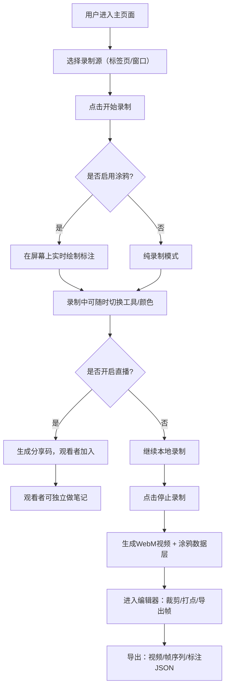

## 1. 产品概述

ScreenStudio 是一款基于浏览器的屏幕录制与实时涂鸦协作工具，无需安装任何插件即可使用。专为在线教育、技术演示、协作评审等场景设计，让用户能够录制屏幕操作、实时绘制标注、分享直播流，并进行后期剪辑与导出。

- **核心价值**：一站式解决"录屏+标注+协作+剪辑"全流程，降低内容创作门槛
- **目标用户**：教育工作者、产品经理、技术支持、远程协作团队

## 2. 核心功能

### 2.1 用户角色

| 角色 | 登录方式 | 核心权限 |
|------|----------|----------|
| 录制者 | 无需登录，直接使用 | 发起录制、涂鸦标注、直播分享、剪辑导出 |
| 观看者 | 通过分享链接加入 | 观看直播、独立做笔记、导出笔记为JSON |

### 2.2 功能模块

1. **录制工作台**：屏幕捕获控制、录制状态显示、鼠标轨迹追踪
2. **涂鸦工具箱**：画笔、箭头、矩形、高亮、颜色选择、粗细调节、橡皮擦、撤销重做
3. **直播中心**：生成分享码、观看者列表、实时同步涂鸦数据
4. **视频编辑器**：时间轴展示、Bookmark打点、首尾裁剪、帧序列导出
5. **媒体库**：本地录制列表、外部视频上传、二次标注导出
6. **设置面板**：快捷键配置、导出参数、画布预设

### 2.3 页面详情

| 页面名称 | 模块名称 | 功能描述 |
|----------|----------|----------|
| 主工作台 | 顶部工具栏 | 录制/暂停/停止按钮、计时器、设置入口、导出菜单 |
| 主工作台 | 中央预览区 | 屏幕预览画布、涂鸦叠加层、鼠标光标高亮 |
| 主工作台 | 左侧工具箱 | 画笔工具切换、颜色/粗细参数、橡皮擦、撤销重做 |
| 主工作台 | 右侧面板 | 标签页切换：直播/书签/笔记/媒体库 |
| 主工作台 | 底部时间轴 | 播放控制、进度条、Bookmark标记点、裁剪选区 |
| 直播观看页 | 视频区 | 实时播放录屏流、涂鸦叠加层开关 |
| 直播观看页 | 笔记区 | 独立涂鸦画布、时间戳关联、JSON导出 |

## 3. 核心流程

## 4. 用户界面设计

### 4.1 设计风格

- **主色调**：深空蓝 `#0F172A` 作为背景基底，搭配电光青 `#22D3EE` 作为功能强调色，辅以琥珀橙 `#F59E0B` 用于录制状态警示
- **按钮风格**：圆润胶囊形（border-radius: 9999px），带微发光hover效果，按下有深度反馈
- **字体**：标题使用 Space Grotesk（几何无衬线，科技感），正文使用 JetBrains Mono（等宽易读）
- **布局风格**：暗色玻璃拟态（Glassmorphism），半透明面板 +  backdrop-blur，主内容区居中，工具面板浮动
- **图标风格**：Lucide 线性图标，统一尺寸 18px，激活态填充强调色

### 4.2 页面设计概览

| 页面名称 | 模块名称 | UI元素 |
|----------|----------|--------|
| 主工作台 | 顶部工具栏 | 深色玻璃条、红色录制脉冲指示灯、计时器（00:00:00）、胶囊按钮组 |
| 主工作台 | 预览画布 | 16:9容器、居中显示、悬浮工具条（画笔快捷切换）、边框发光效果 |
| 主工作台 | 左侧工具箱 | 垂直图标列、选中项背景高亮、展开式颜色调色板（6色预设+自定义） |
| 主工作台 | 右侧面板 | 标签式导航（直播📡/书签🔖/笔记📝/媒体📁）、滚动内容区 |
| 主工作台 | 时间轴 | 波形底纹、可拖动首尾裁剪把手、菱形Bookmark标记点、播放头竖线 |
| 直播观看页 | 视频区 | 全屏优先、右下角涂鸦开关（眼睛图标）、顶部房间号显示 |

### 4.3 响应式

- 桌面端优先（1280px+）：四栏布局（工具栏+工具箱+预览+面板）
- 平板端（768-1279px）：工具箱折叠为浮动按钮，右侧面板可滑入
- 移动端（<768px）：纵向单列，画布自适应，底部抽屉式工具

### 4.4 动效设计

- 录制按钮：录制中红色外圈脉冲呼吸动画（scale 1→1.2，opacity 1→0.5循环）
- 涂鸦绘制：笔画起点和终点带渐入渐出透明度
- 面板切换：Tab切换带150ms滑动过渡+内容淡入
- Bookmark标记：添加时从中心点向外扩散的涟漪动效
- 时间轴裁剪把手：hover时放大1.2倍，带阴影高亮
