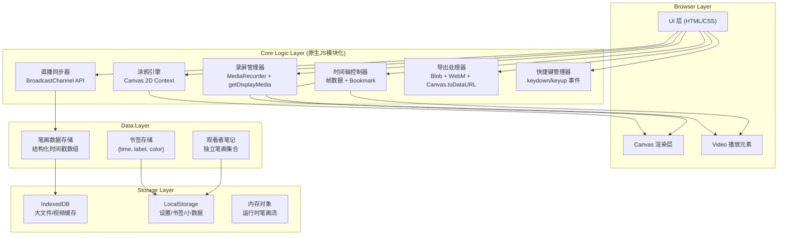

## 1. 架构设计



## 2. 技术说明

- **前端技术**：原生 HTML5 + CSS3 + JavaScript (ES2020)，零框架依赖，单页应用结构
- **模块化方案**：ES Modules (import/export)，通过 `<script type="module">` 加载
- **录屏核心**：`navigator.mediaDevices.getDisplayMedia()` 获取屏幕流 + `MediaRecorder` 编码 WebM
- **涂鸦核心**：双 Canvas 分层（底层视频帧、上层笔画叠加），离屏 Canvas 做笔画缓冲
- **直播同步**：`BroadcastChannel API` 实现同源多标签页通信，模拟多人观看场景
- **存储**：IndexedDB（视频Blob、笔画大数据）+ LocalStorage（配置、书签）
- **无后端**：纯前端实现，直播功能基于浏览器标签页间通信模拟

## 3. 模块文件结构

| 文件路径 | 职责 |
|----------|------|
| `index.html` | 主入口，DOM 结构、工具面板、画布容器 |
| `styles/main.css` | 全局样式、设计系统变量、玻璃拟态、动画 |
| `js/app.js` | 应用入口、模块装配、全局事件总线 |
| `js/core/Recorder.js` | 屏幕捕获、MediaRecorder 封装、录制状态机 |
| `js/core/DrawEngine.js` | 涂鸦引擎：画笔/箭头/矩形/高亮/橡皮擦算法、撤销重做栈 |
| `js/core/Timeline.js` | 时间轴管理、帧定位、Bookmark CRUD、裁剪区间计算 |
| `js/core/StreamSync.js` | BroadcastChannel 封装、直播房间管理、笔画广播 |
| `js/core/Exporter.js` | WebM 导出、帧序列 PNG、JSON 序列化/反序列化 |
| `js/core/ShortcutManager.js` | 快捷键注册、冲突处理、可配置绑定 |
| `js/ui/Toolbar.js` | 顶部工具栏 UI 交互、按钮状态管理 |
| `js/ui/Toolbox.js` | 左侧工具箱、颜色选择器、粗细滑块 |
| `js/ui/TimelineUI.js` | 底部时间轴渲染、裁剪把手拖拽、Bookmark 标记交互 |
| `js/ui/SidePanel.js` | 右侧标签面板（直播/书签/笔记/媒体库） |
| `js/utils/storage.js` | IndexedDB 封装、LocalStorage 封装 |
| `js/utils/format.js` | 时间格式化、颜色转换、数据校验 |

## 4. 核心数据结构

### 4.1 笔画数据结构 (Stroke)

```typescript
interface Point {
  x: number;          // 画布相对坐标 (0-1)
  y: number;
  pressure?: number;  // 压感，默认1
  timestamp: number;  // 毫秒，相对于录制起点
}

interface Stroke {
  id: string;                    // UUID
  tool: 'pen' | 'arrow' | 'rect' | 'highlight' | 'eraser';
  color: string;                 // hex 或 rgba
  width: number;                 // 像素
  points: Point[];               // 路径点
  startTime: number;             // 笔画开始时间(ms)
  endTime: number;               // 笔画结束时间(ms)
  visible?: boolean;             // 显隐开关，非破坏性编辑
  authorId?: string;             // 区分录制者/观看者笔记
}
```

### 4.2 Bookmark 数据结构

```typescript
interface Bookmark {
  id: string;
  time: number;         // 毫秒
  label: string;
  color: string;        // 标记点颜色
  createdAt: number;
}
```

### 4.3 录制工程数据 (Project)

```typescript
interface Project {
  id: string;
  title: string;
  createdAt: number;
  duration: number;     // ms
  videoBlobId: string;  // IndexedDB key
  videoSize: { width: number; height: number };
  strokes: Stroke[];
  bookmarks: Bookmark[];
  clipStart: number;    // 裁剪起点 ms
  clipEnd: number;      // 裁剪终点 ms
  settings: {
    fps: number;
    includeAudio: boolean;
    cursorHighlight: boolean;
  };
}
```

## 5. 快捷键映射（默认）

| 快捷键 | 功能 | 作用域 |
|--------|------|--------|
| `Ctrl/Cmd + R` | 开始/停止录制 | 全局 |
| `Ctrl/Cmd + P` | 暂停/恢复录制 | 录制中 |
| `Ctrl/Cmd + Z` | 撤销上一笔 | 涂鸦模式 |
| `Ctrl/Cmd + Shift + Z` | 重做 | 涂鸦模式 |
| `Ctrl/Cmd + B` | 在当前时间添加 Bookmark | 播放/录制中 |
| `Ctrl/Cmd + D` | 切换画笔工具（开/关） | 全局 |
| `1-5` | 快速切换工具：1画笔 2箭头 3矩形 4高亮 5橡皮 | 涂鸦模式 |
| `[` / `]` | 减小/增大画笔粗细 | 涂鸦模式 |
| `Space` | 播放/暂停视频 | 编辑器模式 |
| `←` / `→` | 后退/前进 5 帧 | 编辑器模式 |

## 6. 关键技术方案

### 6.1 非破坏性涂鸦叠加
- 视频与笔画数据完全分离存储
- 播放时根据当前时间戳动态渲染可见笔画（`stroke.startTime <= currentTime && stroke.endTime >= currentTime`）
- 用户可随时开关涂鸦层显示，不影响原视频
- 导出时可选：烧录到视频 OR 导出单独 JSON

### 6.2 鼠标轨迹追踪
- 通过 `getDisplayMedia` 的 `cursor: "always"` 参数获取光标
- 额外在画布层根据 `mousemove`（录制者端）绘制半透明圆形高亮跟随光标，增强教学效果

### 6.3 多人直播模拟
- 录制者创建房间 → 生成 6 位分享码 → BroadcastChannel 以该码为频道名
- 新标签页输入分享码 → 加入同一 BroadcastChannel → 接收实时笔画数据与视频元信息
- 视频流通过录制者端定期抓取 canvas 帧为 ImageData 发送（降低帧率，确保演示可用）

### 6.4 视频裁剪与帧导出
- 使用 `<video>` + `currentTime` 定位到裁剪区间起点
- 通过 Canvas `drawImage(video)` 逐帧捕获，使用 `MediaRecorder` 重新编码裁剪后的片段
- 帧序列导出：按指定间隔（如每 100ms）定位 → 捕获 → `toBlob('image/png')` → 打包下载
